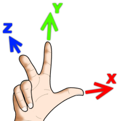

# Math

Math defines data structures and equations for performing and storing multidimensional mathematics.

### Coordinate System

ThreeDart uses the right-handed coordinate system where:

- The X axis is horizontal going left to right
- The Y axis is vertical going bottom to top
- The Z axis is going from the surface of the screen out towards the viewer

### Matrix Mathematics

  P' = M*P

  **TODO** Replace with an image.

  [X']   [XX, YX, ZX][X]
  [Y'] = [XY, YY, ZY][Y]
  [Z']   [XZ, YZ, ZZ][Z]
