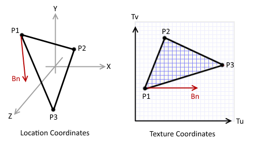

# Shapes

TODO: Add more

### Calculating Binormals

Given:
`P1 = <x1, y1, z1, u1, v1>`
`P2 = <x2, y2, z2, u2, v2>`
`P3 = <x3, y3, z3, u3, v3>`

Try to solve for:
`P4 = <x4, y4, z4, u4, v4>`

Solving using the two-line intersection equation,
Where the first line, `A`, is `<u2, v2, u3, v3>`,
And the second line, `B`, is `<u1, v1, u1+1, v1>`:
`dAu = u3 - u2`
`dAv = v3 - v2`
`dBu = u1+1 - u1 = 1`
`dBv = v1 - v1 = 0`
`det = (dAu * dBv) - (dAv * dBu)
     = 0*(u3 - u2) - 1*(v3 - v2)
     = v2 - v3`

if `det` is equal to zero then
`Bn = |P3 - P2|` if `dAu > 0` or
`Bn = |P2 - P3|` if `dAu < 0`
else

`dABu = u2 - u1`
`dABv = v2 - v1`
`num = (dABv * dBu) - (dABu * dBv)
     = 1*(v2 - v1) - 0*(u2 - u1)
     = v2 - v1`
`r = num / det`

Use the Bezier linear factor, `r`, to calculate all values of `P4`:
`P4' = P2 + r*(P3-P2)`

The point of intersection may have been behind the initial point,
therefore if `u4 - u1 < 0` then use `Bn = |P3 - P4|`
else `Bn = |P4 - P3|`.
